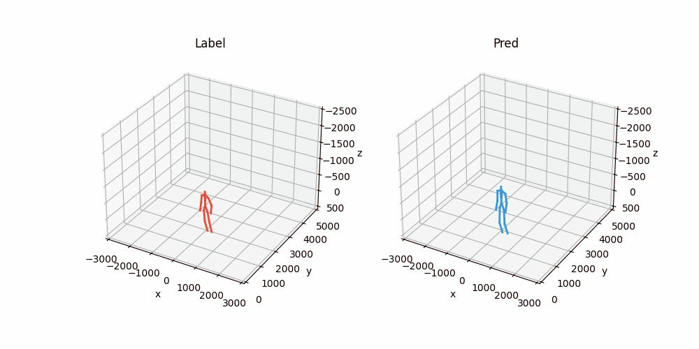
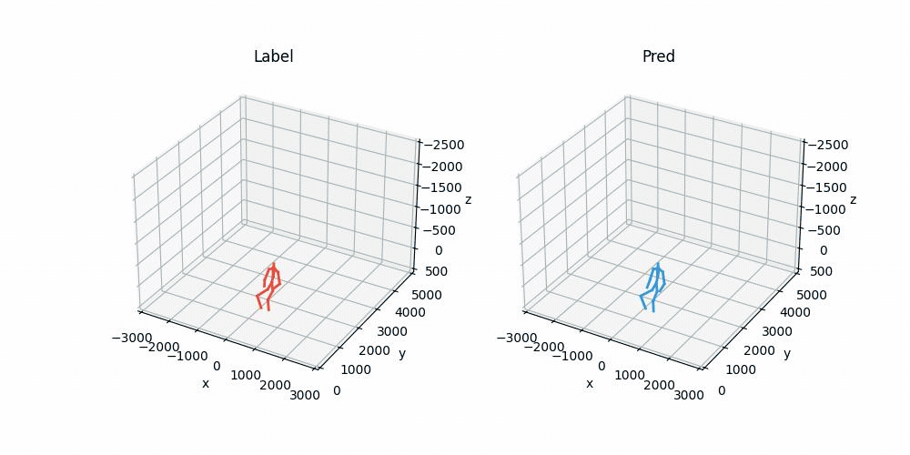

# mmHPE: Robust Multi-Scale 3D Human Pose Estimation Using a Single mmWave Radar
This repository represents the official implementation of the [mmHPE: Robust Multi-Scale 3D Human Pose Estimation Using a Single mmWave Radar](https://ieeexplore.ieee.org/document/10707266).

|  |  |
|:------:|:-------:|
|walking in place|squatting deeply|
|  |  |
|walking back and forth|walking from side to side|
|  |  |
|standing and waving|sitting and typing|
|  |  |
|walking in a circle|walking at random|


## Dataset
Download `mmHPE Dataset` from [Google drive](https://drive.google.com):
```
mmHPE Dataset
└─000  // note
  └─raw
    ├─1.pkl
    ├─2.pkl
    ├─...
```
### Device && Cfg
 - AWR1843BOOST mmWave radar + DCA1000EVM
 - Azure Kinect
```
-------- Radar Cfg --------
-- General
NUM_TX = 3
NUM_RX = 4

-- ProfileConfig
START_FREQ = 77 -- GHz
IDLE_TIME = 10 -- us
RAMP_END_TIME = 60 -- us
ADC_START_TIME = 4 --us
FREQ_SLOPE = 64.985 -- MHz/us
ADC_SAMPLES = 128
SAMPLE_RATE = 2500  -- ksps
RX_GAIN = 30 -- dB

-- FrameConfig
START_CHIRP_TX = 0
END_CHIRP_TX = 2 
NUM_FRAMES = 0
CHIRP_LOOPS = 32 
PERIODICITY = 16.666665  -- ms
```

## Installation
## Citation


We will release the code and dataset soon. Thanks.

